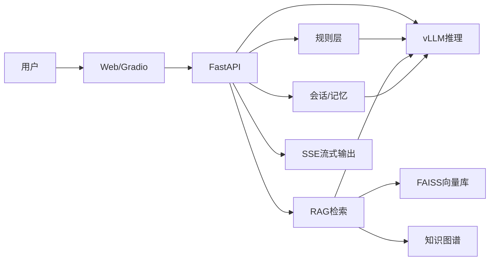

# Medical Agent - 医疗健康智能问答系统

一个基于 LangGraph + vLLM 的医疗健康智能问答系统。系统采用 **规则优先 + RAG 增强** 的混合架构，通过精确的数值规则层解决大模型对医疗数值不敏感及检索歧义问题，并实现会话记忆与上下文工程的结构化控制。

## 目录
- 项目背景与解决的问题
- 核心功能
- 技术架构
- 规则层：核心创新
- 上下文工程
- RAG 检索与知识图谱
- SSE 流式输出
- 快速开始
- Docker 部署
- 评测与指标
- FAQ
- API 参考
- 项目结构
- 许可证

## 项目背景与解决的问题
医疗咨询中常见两个问题：
1. **数值不敏感**：例如体温 38℃ 与 40℃ 的处理策略完全不同，但模型容易混淆。
2. **数值检索歧义**：如用户问“发烧38度”，检索可能误命中“血小板38”。

本项目通过“规则优先 + 结构化字段插入 + RAG 增强”解决上述问题。

## 核心功能
- 规则优先引擎：数值类型识别、风险分级、规则证据置顶
- RAG 检索增强：向量检索 + KG 命中 + 规则证据插入
- 上下文工程：规则区 + 证据区 + 历史摘要 + 当前问题
- SSE 流式输出：先证据后答案，避免证据链错位
- 会话记忆：支持跨会话摘要与短期历史

## 技术架构


## 规则层：核心创新
规则层先对数值进行结构化识别并插入提示词，避免检索被数字误导。

示例：
```
"发烧38度" -> temp_c=38 -> 规则命中：moderate_fever
"发烧40度" -> temp_c=40 -> 规则命中：very_high_fever
```

规则配置：`E:\PythonProject2\medical-agent\configs\clinical_rules.json`
规则引擎：`E:\PythonProject2\app\agent\rule_engine.py`
数值解析：`E:\PythonProject2\app\agent\numeric_parser.py`

## 上下文工程
在进入模型前拼装结构化上下文：
- 规则区（结构化字段 + 规则建议）
- 证据区（检索证据）
- 历史摘要（会话记忆压缩）
- 当前问题

实现位置：`E:\PythonProject2\app\rag\context_engineer.py`

## RAG 检索与知识图谱
- 向量检索：FAISS
- KG 增强：轻量知识图谱检索
- 规则证据优先，RAG 作为补充

实现位置：
- `E:\PythonProject2\app\rag\retriever.py`
- `E:\PythonProject2\app\storage\vector_store.py`
- `E:\PythonProject2\app\kg\graph_store.py`

## SSE 流式输出
SSE 先发送证据，再逐段返回答案，避免证据链错位。

实现位置：`E:\PythonProject2\app\api\routes.py`

## LangGraph 流程编排
流程节点：
1. 会话加载
2. 风险识别
3. 规则抽取 + 查询扩展
4. 检索
5. 重排
6. 假设生成
7. 回答生成
8. 会话持久化

实现位置：`E:\PythonProject2\app\agent\graph.py`

## 快速开始
```bash
# 启动后端
python -m uvicorn app.main:create_app --factory --host 0.0.0.0 --port 8000

# 启动前端
set USE_STREAM=1
python app/gradio_app.py
```

## Docker 部署
1. 启动 vLLM 推理服务（示例）
```bash
cd medical-agent/docker
# 若使用 vLLM compose 文件
# docker compose -f docker-compose.vllm.yml up -d
```
2. 启动后端 API
```bash
python -m uvicorn app.main:create_app --factory --host 0.0.0.0 --port 8000
```

## 评测与指标
- 规则测试：`E:\PythonProject2\medical-agent\scripts\run_rule_tests.py`
- 数据入库：`E:\PythonProject2\medical-agent\scripts\ingest_qa_jsonl.py`
- 索引构建：`E:\PythonProject2\medical-agent\scripts\build_faiss_index_qa.py`

建议指标：
- 规则命中率（rule hit rate）
- 召回命中率（Recall@K）
- 证据一致性（Cited Evidence %）

## FAQ
- 为什么 PowerShell 里中文会乱码？
  使用 UTF-8 方式发送请求体，或 `ConvertTo-Json` + UTF-8 bytes。
- 证据命中“血小板38”怎么办？
  这是数值歧义导致的检索偏差，规则层会先识别体温数值并插入提示词。
- 规则命中却没有生效？
  检查 `/api/debug_rules`，确认是否正确解析数值与规则命中。

## API 参考
- `POST /api/chat`
- `POST /api/chat_stream`
- `POST /api/debug_rules`
- `GET /api/cache_stats`

## 项目结构
```
E:\PythonProject2
├─ app
│  ├─ agent
│  ├─ rag
│  ├─ storage
│  ├─ kg
│  ├─ api
│  └─ gradio_app.py
├─ medical-agent
│  ├─ configs
│  ├─ data
│  ├─ scripts
│  └─ docker
├─ requirements.txt
└─ README.md
```

## 许可证
MIT
